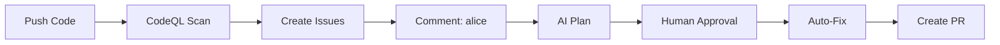

# Alice AI + CodeQL Automated Security Remediation

**Automated security system** that detects vulnerabilities with CodeQL and remediates them with Alice AI.



## 🎯 What This Does

1. **CodeQL scans** for OWASP Top 10 vulnerabilities
2. **Auto-creates issues** with embedded security prompts
3. **Alice AI provides** remediation plans when you comment `@alice`
4. **After approval**, Alice implements the fix and creates a PR

---

## ⚡ Quick Start

### Option 1: One-Command Deploy (Recommended)

```bash
curl -sSL https://raw.githubusercontent.com/AliceNN-ucdenver/MaintainabilityAI/main/examples/agents/deploy-test.sh | bash
```

The script will:
- Clone the template
- Create a GitHub repository
- Configure secrets
- Set up workflows

Just hit **Enter** for all defaults!

### Option 2: Manual Setup

```bash
# 1. Create repo and copy template
gh repo create my-security-demo --public --clone
cd my-security-demo
cp -r /path/to/examples/agents/* .
cp -r /path/to/examples/agents/.github .

# 2. Add Anthropic API key
gh secret set ANTHROPIC_API_KEY --body "sk-ant-api03-..."

# 3. Enable Actions permissions
# Go to: Settings → Actions → General → Workflow permissions
# ✅ Read and write permissions
# ✅ Allow GitHub Actions to create and approve pull requests

# 4. Push and trigger scan
git add . && git commit -m "Initial commit" && git push
```

Get your API key: https://console.anthropic.com/settings/keys

### Test It

Wait ~5 minutes for CodeQL. Then on any issue with `codeql-finding` label:

```
@alice Please provide a remediation plan for this vulnerability
```

Alice analyzes and posts a plan. To approve:

```
@alice approved
```

Alice creates a branch, implements the fix, and opens a PR!

---

## 📦 What's Included

### Vulnerable Demo App (Educational Only)

**`src/app.ts`** - 10+ intentional vulnerabilities:
- SQL injection (A03)
- Broken access control (A01)
- Weak crypto (A02)
- SSRF (A10)
- Path traversal
- And more...

**`src/auth.ts`** - Authentication flaws:
- SHA1 password hashing (should be bcrypt)
- Timing attacks
- No rate limiting

**`src/admin.ts`** - Access control issues:
- No authorization checks
- IDOR vulnerabilities
- Mass assignment

⚠️ **Educational use only** - DO NOT deploy to production!

### GitHub Actions Workflows

**`.github/workflows/codeql.yml`**
- Runs CodeQL security analysis
- Triggers on push, PR, weekly

**`.github/workflows/codeql-to-issues.yml`**
- Creates issues from CodeQL findings
- Embeds OWASP prompts from [maintainability.ai](https://maintainability.ai)
- Smart deduplication and labeling

**`.github/workflows/alice-remediation.yml`**
- Triggers on `@alice` mentions
- Uses `anthropics/claude-code-action@v1`
- Human-in-the-loop approval required
- Auto-implements fixes and creates PRs

### Automation

**`automation/process-codeql-results.js`**
- Parses CodeQL SARIF results
- Maps 32 CodeQL rules → OWASP categories
- Fetches security prompts
- Creates comprehensive issues
- Deduplication and auto-close

**`automation/prompt-mappings.json`**
- CodeQL rule → OWASP mappings (32 rules)
- Links to maintainability patterns
- STRIDE threat model connections

---

## 🔧 Configuration

Edit `.github/workflows/codeql-to-issues.yml`:

```yaml
env:
  SEVERITY_THRESHOLD: 'high'          # critical | high | medium | low
  MAX_ISSUES_PER_RUN: '10'            # Prevent spam
  ENABLE_MAINTAINABILITY: 'true'      # Include quality prompts
  ENABLE_THREAT_MODEL: 'true'         # Include STRIDE
  AUTO_ASSIGN: 'security-team,alice'  # Auto-assign
  EXCLUDED_PATHS: 'test/,node_modules/'
```

---

## 🧪 Example: SQL Injection Fix

**1. CodeQL detects:**
```typescript
// src/app.ts:25
const query = `SELECT * FROM users WHERE username = '${username}'`;
```

**2. Issue created** with:
- `codeql-finding`, `security/critical`, `owasp/a03-injection` labels
- Full OWASP A03 security prompt
- Vulnerable code snippet
- Maintainability guidance
- Human review checklist

**3. Developer comments:** `@alice Please provide a remediation plan`

**4. Alice analyzes and responds:**
```markdown
## 🔍 Remediation Plan

### Root Cause
String concatenation creates SQL injection. Attacker can inject: `' OR '1'='1`

### Solution
Use parameterized queries:
```typescript
const query = 'SELECT * FROM users WHERE username = $1';
const result = await pool.query(query, [username]);
```

### Security Controls
- Parameterized queries
- Zod input validation
- Generic error messages
- Least privilege connection

### Approval Required
Comment: `@alice approved`
```

**5. Developer approves:** `@alice approved`

**6. Alice implements:**
- Creates branch `fix/issue-42-security`
- Updates code with parameterized query
- Adds validation and tests
- Creates PR

**7. Developer reviews and merges** ✅

---

## 📊 Supported Vulnerabilities

### 32 CodeQL Rules Mapped to OWASP Top 10

| OWASP | Example Rules | Count |
|-------|--------------|-------|
| **A01** | path-injection, missing-authorization | 3 |
| **A02** | weak-cryptography, hardcoded-credentials | 3 |
| **A03** | sql-injection, xss, command-injection | 4 |
| **A04** | insufficient-rate-limiting | 2 |
| **A05** | missing-security-headers | 2 |
| **A06** | prototype-pollution | 2 |
| **A07** | weak-password-hashing, timing-attack | 3 |
| **A08** | missing-integrity-check | 2 |
| **A09** | sensitive-data-logging | 2 |
| **A10** | ssrf, unvalidated-redirect | 2 |

See `automation/prompt-mappings.json` for complete list.

---

## 🐛 Troubleshooting

**No issues created?**
```bash
# Lower severity threshold in codeql-to-issues.yml
env:
  SEVERITY_THRESHOLD: 'low'
```

**Alice not triggering?**
```bash
# Verify secret exists
gh secret list | grep ANTHROPIC

# Check issue has 'codeql-finding' label
# Ensure comment contains '@alice'
```

**Permission errors?**
- Settings → Actions → General → Workflow permissions
- ✅ Read and write permissions
- ✅ Allow GitHub Actions to create/approve PRs

---

## 🎓 Documentation

- **[SETUP.md](SETUP.md)** - Comprehensive setup guide
- **[DEPLOY.md](DEPLOY.md)** - Deployment instructions
- **[EXAMPLE_ISSUE.md](EXAMPLE_ISSUE.md)** - Sample generated issue
- **Security Prompts** - https://maintainability.ai/docs/prompts/owasp/
- **Full Docs** - https://maintainability.ai/docs

---

## 🎯 Use Cases

**1. Security Training**
- Learn OWASP Top 10 with vulnerable examples
- Practice remediation with AI guidance

**2. Existing Codebases**
- Deploy to production repositories
- Gradually fix detected vulnerabilities

**3. Security-First Development**
- Enable on all repos
- Catch issues in PRs automatically

**4. Team Education**
- Review Alice's plans as a team
- Build security knowledge

---

## 🔒 Security Notes

### CodeQL Scanning Scope

**What gets scanned**: All application code in your repository is analyzed by CodeQL with `security-extended` queries.

**What's excluded**: The `automation/` directory is excluded from CodeQL scanning via `.github/codeql/codeql-config.yml` because:
- These are framework automation scripts (not application code)
- `process-codeql-results.js` fetches security prompts FROM a trusted remote source with proper validation
- Excluding framework code prevents false positives while preserving security scanning for your actual application

**Security controls in automation scripts**:
- ✅ Domain allowlist verification (only `raw.githubusercontent.com`)
- ✅ HTTPS-only enforcement
- ✅ SHA-256 hash integrity verification of all fetched content
- ✅ Content validation before use

All other security queries remain active to catch real vulnerabilities in your application code.

---

## 🤝 Contributing

Contributions welcome!
- Add CodeQL rule mappings
- Create security prompts
- Enhance Alice instructions

See [MaintainabilityAI](https://github.com/AliceNN-ucdenver/MaintainabilityAI) to contribute.

---

## 📄 License

MIT License - Part of [MaintainabilityAI](https://maintainability.ai)

---

## 🔗 Links

- **MaintainabilityAI**: https://maintainability.ai
- **Alice Agent Docs**: https://maintainability.ai/docs/agents/alice
- **OWASP Top 10**: https://owasp.org/Top10/
- **CodeQL**: https://codeql.github.com
- **Claude Action**: https://github.com/anthropics/claude-code-action

---

**🤖 Built with Claude AI** following the MaintainabilityAI framework's security-first principles.

**Questions?** Open an issue or check [SETUP.md](SETUP.md).
